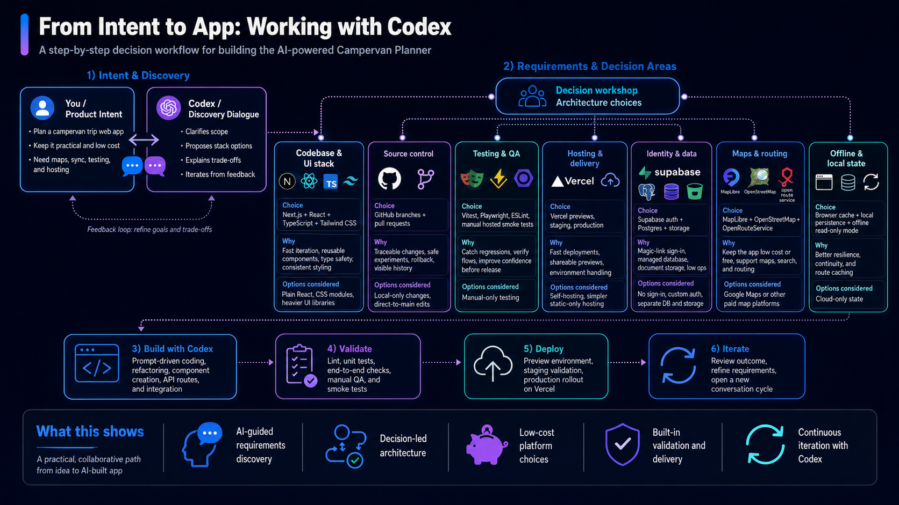
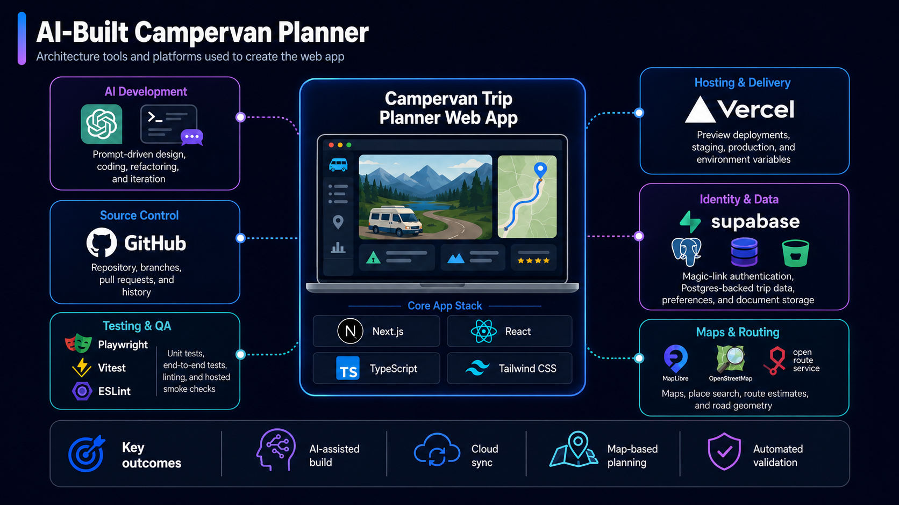

# Architecture and Build Approach

This document describes how the Campervan Trip Planner was designed, built, validated, and
deployed. It complements the operational setup in
[FOUNDATION_ACTIVATION.md](FOUNDATION_ACTIVATION.md) and the product roadmap in
[PRODUCT_PLAN.md](PRODUCT_PLAN.md).

## From Intent to App

The app was developed iteratively with Codex: product intent and practical constraints were
turned into explicit architecture choices, implemented in small changes, validated locally and
on hosted preview, and then refined from the results.

## System Architecture

The diagrams are accurate high-level summaries of the current build, with these clarifications:

- “AI-powered” in the intent diagram describes the AI-assisted development process. The current
  planner does not call a generative-AI model as part of its end-user runtime.
- Supabase currently provides magic-link authentication and Postgres-backed trip and preference
  data. The app stores complete trip documents as JSON in Postgres; it does not currently use
  Supabase object storage.
- Offline support is intentionally read-only. IndexedDB, with a `localStorage` fallback, caches
  the last synced active trip so it can be reopened without a network connection.
- Vercel preview and staging have been exercised against live services. The `production` branch
  remains a deliberate promotion target rather than the normal development lane.
- OpenStreetMap data supports the current low-cost map stack through Nominatim place search and
  configurable raster tiles. A more durable tile provider should replace the default public tile
  fallback before a wider public launch.

## Runtime Shape

The browser runs the Next.js/React planner UI and calls same-origin Next.js route handlers.
Those handlers keep service credentials server-side and provide the boundary to Supabase,
Nominatim, and OpenRouteService.

| Area | Current implementation |
| --- | --- |
| UI | Next.js App Router, React, TypeScript, Tailwind CSS |
| Client state | Zustand for planner state; explicit draft save/cancel behavior |
| Maps | MapLibre GL rendering configurable raster tiles, defaulting to OpenStreetMap tiles |
| Place search | Server-side `/api/geocode` proxy to Nominatim with throttling and caching |
| Routing | Server-side OpenRouteService calls with cached responses and haversine fallback |
| Identity | Supabase email magic-link authentication |
| Cloud data | Supabase Postgres trip documents and user trip preferences |
| Offline data | IndexedDB cache with `localStorage` fallback; read-only reopen |
| Hosting | Vercel branch previews, protected staging validation, deliberate production promotion |
| Validation | ESLint, Vitest, API route tests, Playwright E2E, and hosted smoke checks |

## Important Data Flows

### Authentication and cloud trips

1. The browser obtains and persists a Supabase auth session.
2. Authenticated requests send the bearer token to the app's `/api/trips` and
   `/api/trip-preferences` route handlers.
3. Route handlers verify the user and read or write user-owned rows in Supabase Postgres.
4. Successful trip loads and saves update the browser's offline cache.

### Place search and routing

1. A user deliberately submits a place search from the stop editor.
2. `/api/geocode` queries Nominatim, applying GB-focused search, rate limiting, and caching.
3. `/api/route-access` can request road-access coordinates from OpenRouteService.
4. `/api/route-estimates` requests road geometry and timings from OpenRouteService.
5. If live routing is unavailable, the planner returns a clearly identified straight-line
   fallback estimate rather than blocking itinerary work.

### Delivery and validation

1. Work is versioned in Git and hosted on GitHub.
2. `npm run validate:local` runs Vitest, ESLint, the production build, and Playwright.
3. Approved `main` commits can be promoted to the protected `staging` Vercel preview.
4. Hosted smoke checks exercise the preview against live Supabase and OpenRouteService services.
5. Production remains a separate, intentional branch promotion.

## Design Principles

- **Keep the first release inexpensive.** The current service choices have useful free or hobby
  tiers and avoid paid map platforms during private validation.
- **Degrade clearly instead of failing silently.** Missing routing falls back to identified
  estimates; missing connectivity permits a read-only cached trip.
- **Keep secrets behind server routes.** Provider service-role and routing keys are not exposed
  to browser code.
- **Validate locally before consuming hosted resources.** Deterministic tests run before staging
  promotion and live-service smoke checks.
- **Delay infrastructure complexity.** Managed services and browser storage cover the current
  scale; wider rollout requirements are recorded in
  [SCALING_CONSIDERATIONS.md](SCALING_CONSIDERATIONS.md).
